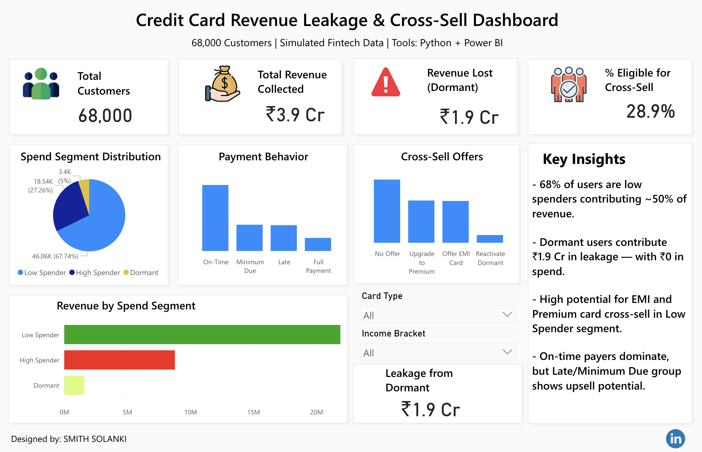

# 💳 Credit Card Revenue Leakage & Cross-Sell Opportunity Analysis

A data analytics project focused on identifying revenue leakage and upselling potential in a simulated credit card customer base using **Python** and **Power BI**.


---

## 🔍 Project Overview

**Objective:**  
To analyze 68,000 simulated credit card customers to:
- Identify segments causing **revenue leakage** (especially dormant users).
- Analyze **payment behavior and spend distribution**.
- Recommend **cross-sell opportunities** like EMI & premium cards to maximize revenue.

---

## 📈 Key Metrics & Findings

| Metric                        | Value         |
|------------------------------|---------------|
| Total Customers              | 68,000        |
| Revenue Collected            | ₹3.9 Cr       |
| Revenue Lost (Dormant Users) | ₹1.9 Cr       |
| Eligible for Cross-Sell      | 28.9%         |

### 🔑 Key Insights:
- **68%** of customers are **Low Spenders**, contributing ~50% of revenue.
- **Dormant users (5%)** lead to ₹1.9 Cr in lost revenue.
- Highest potential to cross-sell **EMI** and **Premium** cards to on-time paying low spenders.

---

## 🛠 Tools & Technologies

- 📊 **Power BI** – KPI dashboarding and visualization
- 🐍 **Python** – Data cleaning, analysis (pandas, numpy, matplotlib)
- 📁 **Jupyter Notebook** – Exploratory data analysis
- 🧠 **Segmentation** – Spend tiers, payment behavior classification

---

## 📊 Dashboard Preview

> Interactive Power BI dashboard displaying:
> - Spend Segment Distribution
> - Payment Behavior
> - Cross-Sell Eligibility
> - Leakage from Dormant Users



---

## 📁 Project Structure

```bash
├── Credit Card Revenue Leakage & Cross-Sell Opportunity Analysis.ipynb
├── dashboard-thumbnail.png
├── credit-card-dashboard.png
├── cleaned_dataset.csv
└── README.md
